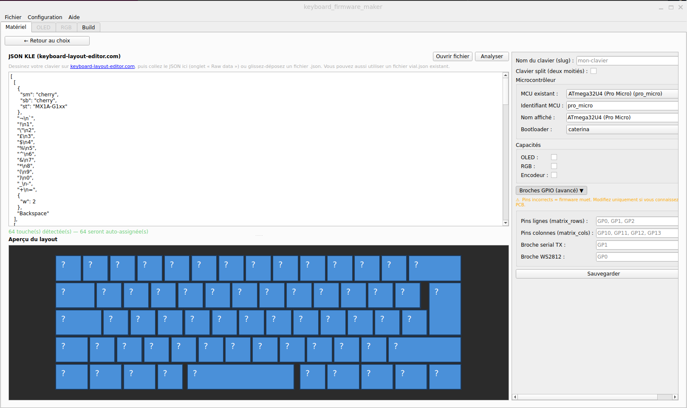
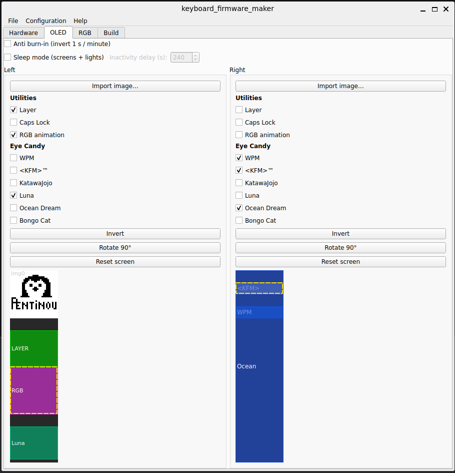
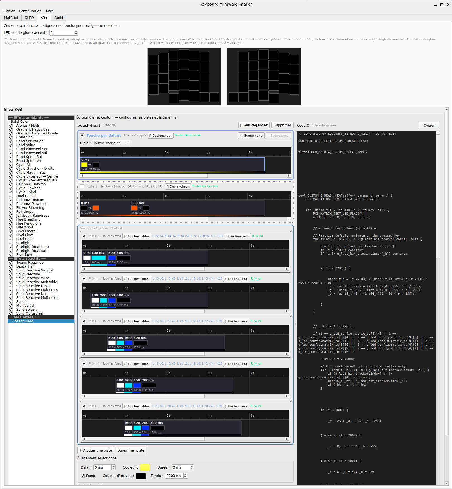
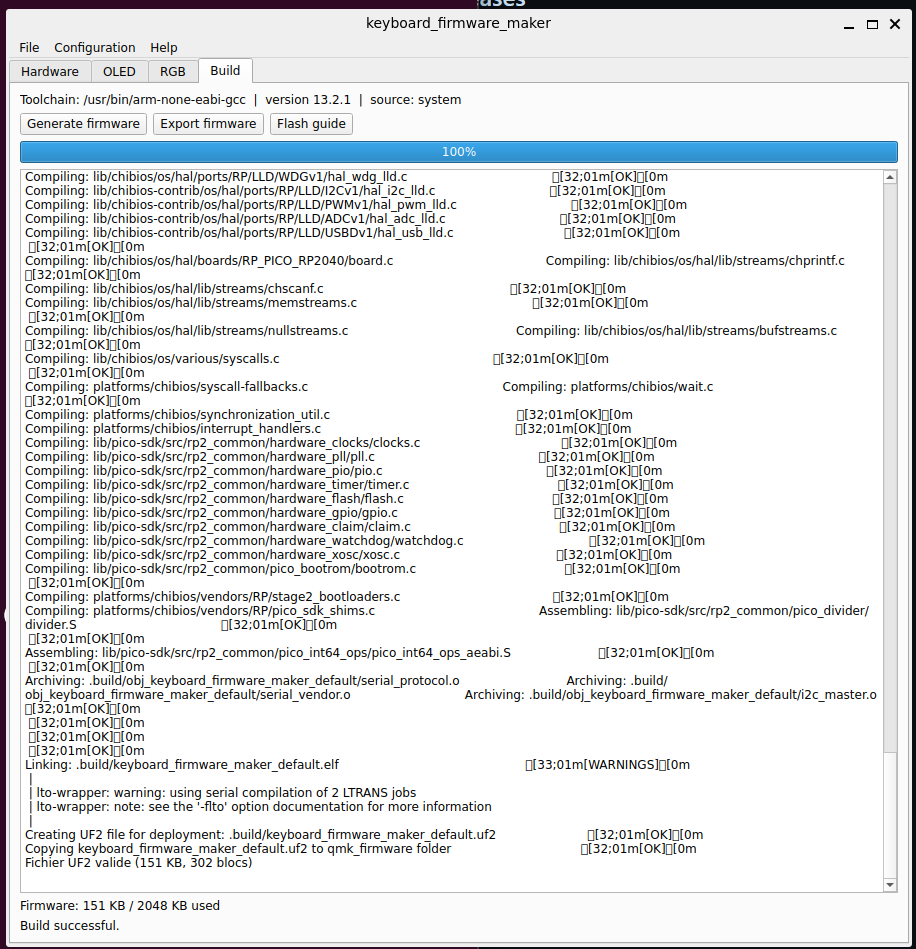

# Keyboard Firmware Maker

A desktop application to create, customize, and compile Vial-QMK firmware for split mechanical keyboards — no coding required.


## Screenshots

| Hardware selection | OLED editor |
|---|---|
|  |  |

| RGB configurator | Build & flash |
|---|---|
|  |  |

## Features

- **Hardware** — 3 split keyboards (Sofle v2, Corne, Lily58) with multiple MCU options per board; all pin mappings defined in YAML
- **OLED editor** — Dual 128x32 canvas, drag-and-drop positioning, animated GIF import, built-in sprites (Luna, Bongo Cat, Ocean Dream, KatawaJojo), anti-burn-in timeout, sleep mode
- **RGB lighting** — 45 effects with live preview, per-key color painting, custom ripple effect
- **Build system** — Jinja2-based code generation, one-click compilation, UF2 export, illustrated step-by-step flash guide
- **Project files** — Save and load full configurations as `.kfm.json`
- **Internationalization** — English, French, Italian

## Supported Keyboards

| Keyboard | Keys | MCU Options | Encoder | RGB | OLED |
|---|---|---|---|---|---|
| Sofle v2 | 58 + 2 encoders | RP2040 | Yes | Yes | Yes |
| Corne (crkbd) | 42 | Pro Micro, Elite-C, RP2040 | No | No | Yes |
| Lily58 | 58 | Pro Micro, Elite-C, RP2040 | No | No | Yes |

## Requirements

- Python >= 3.11
- Linux or WSL2 (Windows native is not yet supported)
- `git`, `make`
- `arm-none-eabi-gcc` (auto-detected or vendored by the Vial-QMK build system)

## Installation

```bash
git clone https://github.com/pentinou/keyboard_firmware_maker.git
cd keyboard_firmware_maker
pip install -r requirements.txt
```

> Alternatively, if you plan to contribute: `pip install -e ".[dev]"`

## Quick Start

```bash
python main.py
```

On first launch, the app prompts you to clone the Vial-QMK repository. Once that completes, select your keyboard, MCU, and start customizing.

## Adding a Custom Keyboard

Drop a `.yaml` file into the `keyboards/` directory. The file describes:

```yaml
model: my-keyboard
display_name: "My Keyboard"
mcu_options:
  - id: rp2040
    bootloader: "rp2040"
    pins:
      matrix_rows: ["GP4", "GP5", "GP6", "GP7"]
      matrix_cols: ["GP29", "GP28", "GP27", "GP26", "GP22", "GP20"]
      serial_tx: "GP1"
      serial_driver: "vendor"
diode_direction: "COL2ROW"
layout_macro: "LAYOUT_split_3x6_3"
has_encoder: false
capabilities:
  oled: true
  rgb: false
matrix:
  rows: 4
  cols: 6
layout:
  left: [...]
  right: [...]
```

See `keyboards/corne.yaml` for a full example.

## Development

```bash
pip install -e ".[dev]"
pytest
```

Linting:

```bash
ruff check .
black --check .
```

## License

This project is licensed under the **GNU General Public License v3.0**. See [LICENSE](LICENSE) for the full text.
